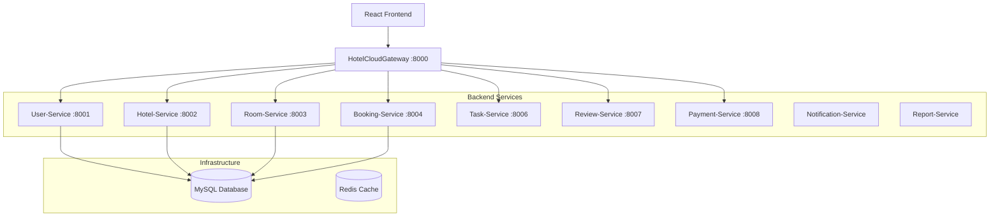

# 🏨 Hotel Management System (HMS)

A comprehensive, microservices-based Hotel Management System designed for efficient hotel operations, featuring a robust Spring Boot backend and a modern React frontend.

---

## 🏗️ Architecture Overview

The system follows a **Microservices Architecture** with a central **API Gateway** managing traffic to various specialized services. 

---

## 🚀 Repositories

- **Backend:** [MSS301_hotel_management_project](https://github.com/DangNgocThanhk18/MSS301_hotel_management_project)
- **Frontend:** [Hotel Management Frontend](https://github.com/Hiepbq2003/Microservice_HotelManagement) 

---

## ✨ Key Features

### 👤 User & Role Management
- Secure authentication with **JWT (JSON Web Tokens)**.
- Role-based access control: Admin, Manager, Staff, and Customer.
- Professional profiles and activity tracking.

### 🏨 Hotel & Room Operations
- Multi-hotel management capabilities.
- Room inventory tracking with real-time availability.
- Dynamic pricing and room category management.

### 📅 Booking & Reservation
- End-to-end booking flow for customers.
- Walk-in booking support for staff.
- Voucher and discount system integration.

### 🧹 Operational Tools
- **Task Management:** Specialized workflows for Housekeeping and Maintenance.
- **Reporting:** Data-driven insights via specialized Report-Service.
- **Reviews:** Comprehensive feedback system for guests.

---

## 🛠️ Tech Stack

### Backend (Java/Spring)
- **Framework:** Spring Boot 3.4.3
- **Microservices:** Spring Cloud (Gateway, OpenFeign)
- **Security:** Spring Security + JWT
- **Persistence:** Spring Data JPA + Hibernate
- **Database:** MySQL
- **Others:** Lombok, Maven

### Frontend (React)
- **Library:** React 18
- **UI Frameworks:** Bootstrap 5, MDB React UI Kit
- **Charts:** Recharts, Chart.js
- **Routing:** React Router 7
- **Icons:** React Icons

---

## 🚦 Getting Started

### Prerequisites
- **Java 17+**
- **Node.js 18+**
- **MySQL 8+**
- **Maven 3.8+**

### Backend Setup
1. Clone the backend repository.
2. Configure `application.properties` in each service with your MySQL credentials.
3. Run `mvn clean install` in the root of the backend project.
4. Start the services in the following order:
   - `User-Service` (Port 8001)
   - Specialized Services (`Hotel-Service`, `Room-Service`, etc.)
   - `HotelCloudGateway` (Port 8000)

### Frontend Setup
1. Navigate to the `hotel_management` directory.
2. Run `npm install` to install dependencies.
3. Run `npm start` to launch the development server.
4. Access the application at `http://localhost:3000`.

---

## 📞 Contact & Contributors
- **Author:** Dang Ngoc Thanh
- **Github:** [@DangNgocThanhk18](https://github.com/DangNgocThanhk18)
